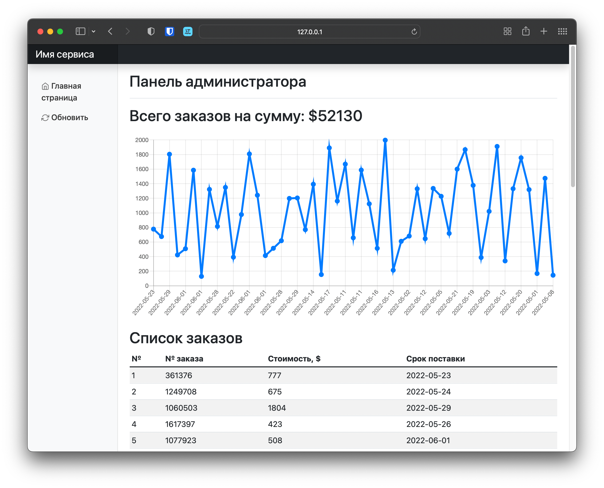

# google-sheets-to-postgres-api

## Установка
1. Клонировать этот репозиторий. `git clone https://github.com/kropochev/google-sheets-to-postgres-api.git`
2. Получение сервисного аккаунта для [Google Cloud Platform](https://console.cloud.google.com/)
    - Создать новый проект
    - Добавить API (Google Docs API, Google Sheets API)
    - Добавить разрешения для ("https://www.googleapis.com/auth/spreadsheets.readonly",
    "https://www.googleapis.com/auth/drive.readonly")
    - Создать сервисный аккаунт и скачать ключ в формате json
    - Переименовать ключ в key.json и положить в каталог с проектом
    - Добавить сервисному аккаунту доступ к таблице на Google Sheets
3. Заполнить в файле docker-compose.yml переменные
    - GOOGLE_SHEET_NAME - имя таблицы на Google Drive
    - TELEGRAM_TOKEN - токен телеграм бота
    - TELEGRAM_USER_ID - ID пользователя
4. Собрать образ командой `docker-compose build`
5. Запустить командой `docker-compose up -d`

## Пример
Панель администрирования по адресу `http://127.0.0.1:8000/admin`

